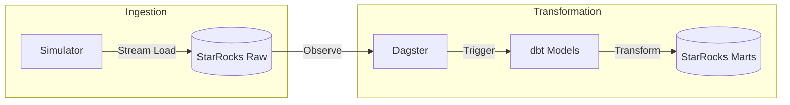

# Retail Analytics Platform - Requirements Document

## 1. Product Overview

A modern, production-ready data platform built with **Dagster**, **dbt**, and **StarRocks**. This system demonstrates best practices for data engineering, including decoupled ingestion, dimensional modeling, and automated orchestration.

The platform simulates a real-time retail environment where data is continuously generated, ingested, and transformed into analytical insights.

## 2. Core Features

### 2.1 Architecture
The system follows a decoupled monorepo architecture with two main components:

1.  **Ingestion Simulator**: A standalone service that generates mock retail data and ingests it directly into StarRocks.
2.  **Transformation Pipeline**: A Dagster + dbt pipeline that observes the data warehouse and triggers transformations.

### 2.2 Component Details

| Component | Technology | Description |
|-----------|------------|-------------|
| **Data Warehouse** | StarRocks | High-performance OLAP database storing Raw, Staging, and Mart layers. |
| **Ingestion** | Python (Stream Load) | Generates synthetic data (Orders, Customers, Products) and loads it via HTTP Stream Load. |
| **Transformation** | dbt Core | Transforms raw data into a Star Schema (Facts & Dimensions). |
| **Orchestration** | Dagster | Manages assets, observes sources, and automates execution. |
| **Environment** | Docker / uv | Containerized infrastructure and modern Python package management. |

## 3. Data Flow

1.  **Generation**: The **Ingestion Simulator** generates batch data (JSON).
2.  **Ingestion**: Data is pushed to StarRocks `raw_*` tables using **Stream Load**.
3.  **Observation**: Dagster's `check_sources_job` polls StarRocks every minute to detect new rows.
4.  **Trigger**: The `AutomationConditionSensor` detects changes in source assets.
5.  **Transformation**: Dagster triggers dbt models to update `stg_*` and `dim_*/fact_*` tables.
6.  **Analytics**: Clean, modeled data is ready for querying in StarRocks.



## 4. Technical Architecture

### 4.1 Project Structure
```
retail-analytics-platform/
├── ingestion_simulator/        # Standalone Ingestion Tool
│   ├── src/                    # Python Source
│   └── Makefile                # CLI Commands
├── transformation_pipeline/    # Data Pipeline
│   ├── dagster_project/        # Assets, Resources, Sensors
│   ├── dbt_project/            # dbt Models (Staging, Marts)
│   └── Makefile                # Pipeline Commands
├── docker-compose.yml          # Infrastructure (StarRocks)
└── Makefile                    # Root Orchestrator
```

### 4.2 Technology Stack
*   **Language**: Python 3.12+
*   **Orchestration**: Dagster 1.12+
*   **Transformation**: dbt-starrocks 1.8+
*   **Database**: StarRocks 3.x
*   **Package Manager**: `uv`

### 4.3 Data Model
*   **Raw Layer**: `raw_customers`, `raw_products`, `raw_orders` (JSON/String types).
*   **Staging Layer**: Type casting, cleaning, and normalization.
*   **Marts Layer**:
    *   `dim_customers`: SCD Type 1 dimension.
    *   `dim_products`: Product catalog.
    *   `fact_daily_sales`: Daily aggregated sales metrics.

## 5. Quality Assurance

### 5.1 Data Quality
*   **dbt Tests**:
    *   `unique`, `not_null` constraints on primary keys.
    *   `relationships` (Foreign Key) checks.
    *   `accepted_values` for status fields.

### 5.2 Development Workflow
1.  **Setup**: `make setup` initializes environment and DB.
2.  **Dev**: `make dev` starts Dagster UI.
3.  **Simulate**: `make generate` pushes data.
4.  **Verify**: Dashboard shows lineage and test results.
